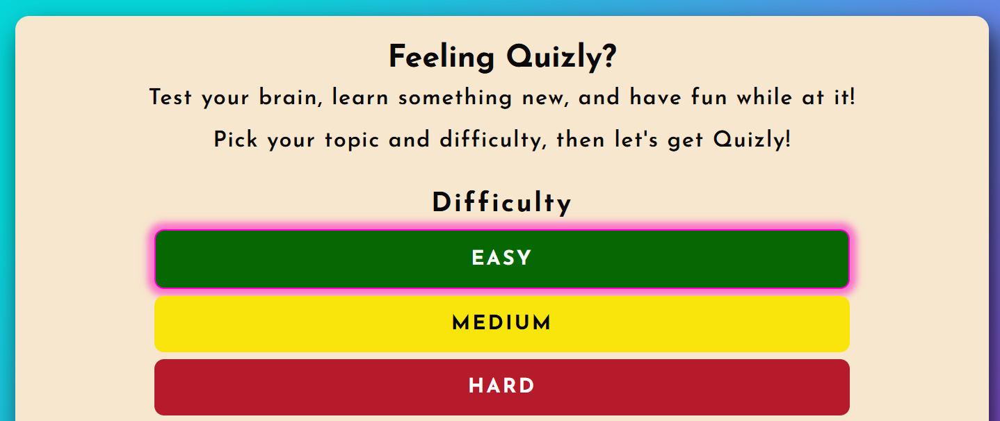

# Testing

> [!NOTE]  
> Return back to the [README.md](README.md) file.

⚠️ INSTRUCTIONS ⚠️

In the following sections, you need to convince the assessors that you have conducted enough manual testing to legitimately believe that the site works well. Essentially, in this part, you should go over all of your project's features, and ensure that they all work as intended, with the project providing an easy and straightforward way for the users to achieve their goals.

⚠️ --- END --- ⚠️

## Code Validation

⚠️ INSTRUCTIONS ⚠️

Use the space below to discuss code validation for all of your own code files (*where applicable*). You are not required to validate external libraries/frameworks.

**MANDATORY**: You must provide a screenshot for each file you validate.

**PRO TIP**: Where possible, always validate the live URL pages/files, not your local code using copy/paste. There could be subtle/hidden differences.

⚠️ --- END --- ⚠️

### HTML

⚠️ INSTRUCTIONS ⚠️

1. [*recommended*] If you are using the live deployed site URLs, validate using this link: https://validator.w3.org/#validate_by_uri
2. Otherwise, if you are copying/pasting your HTML code manually, use this link: https://validator.w3.org/#validate_by_input

It's recommended to validate the live pages (all of them) using the deployed URL. This will give you a custom URL as well, which you can use below on your testing documentation. It makes it easier to return back to a page for validating it again in the future. The URL will look something like this:

- https://validator.w3.org/nu/?doc=https://Rubina1978.github.io/Just-Quizly/index.html

⚠️ --- END --- ⚠️

I have used the recommended [HTML W3C Validator](https://validator.w3.org) to validate all of my HTML files.

| Directory | File | URL | Screenshot | Notes |
| --- | --- | --- | --- | --- |
|  | [404.html](https://rubina1978.github.io/Just-Quizly/404) | [HTML Validator](https://validator.w3.org/nu/?showsource=yes&doc=https%3A%2F%2Frubina1978.github.io%2FJust-Quizly%2F404) |  |  |
|  | [index.html](https://rubina1978.github.io/Just-Quizly/index) | [HTML Validator](https://validator.w3.org/nu/?doc=https%3A%2F%2Frubina1978.github.io%2FJust-Quizly%2F) |  |  |
|  | [modal.html](https://github.com/Rubina1978/Just-Quizly/blob/main/modal.html) | [HTML Validator](https://validator.w3.org/nu/?doc=https%3A%2F%2Frubina1978.github.io%2FJust-Quizly%2F#textarea) |  |  |

### CSS 

⚠️ INSTRUCTIONS ⚠️

1. [*recommended*] If you are using the live deployed site, use this link: https://jigsaw.w3.org/css-validator/#validate_by_uri
2. If you are copying/pasting your CSS code, use this link: https://jigsaw.w3.org/css-validator/#validate_by_input

It's recommended to validate the live site for your primary CSS file on the deployed URL. This will give you a custom URL as well, which you can use below on your testing documentation. It makes it easier to return back to a page for validating it again in the future. The URL will look something like this:

- https://jigsaw.w3.org/css-validator/validator?uri=https://rubina1978.github.io/Just-Quizly

If you have additional/multiple CSS files, then individual "[validation by input](https://jigsaw.w3.org/css-validator/#validate_by_input)" is recommended for the extra CSS files.

**IMPORTANT**: Third-Party tools

If you're using external libraries/frameworks (e.g: Bootstrap, Materialize, Font Awesome, etc.), then sometimes the tool will attempt to also validate these, even though it's not part of your own actual code that you wrote. You are not required to validate the external libraries or frameworks!

⚠️ --- END --- ⚠️

I have used the recommended [CSS Jigsaw Validator](https://jigsaw.w3.org/css-validator) to validate all of my CSS files.

| Directory | File | URL | Screenshot | Notes |
| --- | --- | --- | --- | --- |
| assets | [style.css](https://github.com/Rubina1978/Just-Quizly/blob/main/assets/css/style.css) | [CSS Validator](https://jigsaw.w3.org/css-validator/validator?uri=https%3A%2F%2Frubina1978.github.io%2FJust-Quizly%2F&profile=css3svg&usermedium=all&warning=1&vextwarning=&lang=en) |  |  |

### JavaScript

⚠️ INSTRUCTIONS ⚠️

If using modern JavaScript (ES6) methods, then make sure to include the following line at the very top of every single JavaScript file in your project (this should remain in your files for submission as well):

`/* jshint esversion: 11 */`

If you are also including jQuery (`$`), then the updated format will be:

`/* jshint esversion: 11, jquery: true */`

This allows the JShint validator to recognize modern ES6 methods, such as: `let`, `const`, `template literals`, `arrow functions (=>)`, etc.

**IMPORTANT**: External resources

Sometimes we'll write JavaScript that imports variables from other files, such as "an array of questions" from `questions.js`, which are used within the main `script.js` file elsewhere. If that's the case, the JShint validation tool doesn't know how to recognize "unused variables" that would normally be imported locally when running your own project. These warnings are acceptable, so showcase on your screenshot(s).

The same thing applies when using external libraries such as Stripe, Leaflet, Bootstrap, Materialize, etc. To instantiate these components, we need to use their respective declarator. Again, the JShint validation tool would flag these as "undefined/unused variables". These warnings are acceptable, so showcase on your screenshot(s).

⚠️ --- END --- ⚠️

I have used the recommended [JShint Validator](https://jshint.com) to validate all of my JS files.

| Directory | File | URL | Screenshot | Notes |
| --- | --- | --- | --- | --- |
|  | [script.js](https://github.com/Rubina1978/Just-Quizly/blob/51e65759deacaf7a8c079191cdfad157c1ce332f/script.js) |  |  | No error mentioned just undefined and one unused variable all are external |

## Responsiveness

⚠️ INSTRUCTIONS ⚠️

Use this space to discuss testing the live/deployed site on various device sizes.

The minimum requirement is to test the following 3 sizes:

- Mobile
- Tablet
- Desktop

**IMPORTANT**: You must provide screenshots of your results, to "prove" that you've actually tested them.

Using the [amiresponsive](http://ami.responsivedesign.is) mockup images (*or similar*) does not meet the requirements. Consider using some of the built-in device sizes from the Developer Tools.

If you have tested the project on your actual mobile phone or tablet, consider also including screenshots of these as well. It showcases a higher level of manual tests, and can be seen as a positive inclusion!

⚠️ --- END --- ⚠️

I've tested my deployed project to check for responsiveness issues.

| Page | Mobile | Tablet | Desktop | Notes |
| --- | --- | --- | --- | --- |
| Home |  |  |  | Works as expected |
| Quiz |  |  |  | Works as expected |
| End Screen |  |  |  | Works as expected |
| 404 |  |  |  | Works as expected |

## Browser Compatibility

⚠️ INSTRUCTIONS ⚠️

Use this space to discuss testing the live/deployed site on various browsers. Consider testing at least 3 different browsers, if available on your system. You DO NOT need to use all of the browsers below, just pick any 3 (minimum).

Recommended browsers to consider:
- [Chrome](https://www.google.com/chrome)
- [Firefox (Developer Edition)](https://www.mozilla.org/firefox/developer)
- [Edge](https://www.microsoft.com/edge)
- [Safari](https://support.apple.com/downloads/safari)
- [Brave](https://brave.com/download)
- [Opera](https://www.opera.com/download)

**IMPORTANT**: You must provide screenshots of the browsers you've tested, to "prove" that you've actually tested them.

Please note, there are services out there that can test multiple browser compatibilities at the same time. Some of these are paid services, but some are free. If you use these, you must provide a link to the source used for attribution, and multiple screenshots of the results.

⚠️ --- END --- ⚠️

I've tested my deployed project on multiple browsers to check for compatibility issues.

| Page | Chrome | Firefox | Edge | Notes |
| --- | --- | --- | --- | --- |
| Home |  |  |  | Works as expected |
| Quiz |  |  |  | Works as expected |
| End-screen |  |  |  | Works as expected |
| 404 |  |  |  | Works as expected |

## Lighthouse Audit

I've tested my deployed project using the Lighthouse Audit tool to check for any major issues. Some warnings are outside of my control, and mobile results tend to be lower than desktop.

| Page | Mobile | Desktop |
| --- | --- | --- |
| Index |  |  |
| 404 |  |  |

## Defensive Programming

⚠️ INSTRUCTIONS ⚠️

Defensive programming (defensive design) is extremely important! When building projects that accept user inputs or forms, you should always test the level of security for each form field. Examples of this could include (but not limited to):

All Projects:

- Users cannot submit an empty form (add the `required` attribute)
- Users must enter valid field types (ensure the correct input `type=""` is used)
- Users cannot brute-force a URL to navigate to a restricted pages

Python Projects:

- Users cannot perform CRUD functionality if not authenticated (if login functionality exists)
- User-A should not be able to manipulate data belonging to User-B, or vice versa
- Non-Authenticated users should not be able to access pages that require authentication
- Standard users should not be able to access pages intended for superusers/admins

You'll want to test all functionality on your application, whether it's a standard form, or CRUD functionality, for data manipulation on a database. Try to access various pages on your site as different user types (User-A, User-B, guest user, admin, superuser). You should include any manual tests performed, and the expected results/outcome.

Testing should be replicable (can someone else replicate the same outcome?). Ideally, tests cases should focus on each individual section of every page on the website. Each test case should be specific, objective, and step-wise replicable.

Instead of adding a general overview saying that everything works fine, consider documenting tests on each element of the page (eg. button clicks, input box validation, navigation links, etc.) by testing them in their "happy flow", their "bad/exception flow", mentioning the expected and observed results, and drawing a parallel between them where applicable.

Consider using the following format for manual test cases:

- Expected Outcome / Test Performed / Result Received / Fixes Implemented

- **Expected**: "Feature is expected to do X when the user does Y."
- **Testing**: "Tested the feature by doing Y."
- (either) **Result**: "The feature behaved as expected, and it did Y."
- (or) **Result**: "The feature did not respond to A, B, or C."
- **Fix**: "I did Z to the code because something was missing."

Use the table below as a basic start, and expand on it using the logic above.

⚠️ --- END --- ⚠️

Defensive programming was manually tested with the below user acceptance testing:

| Page/Feature | Expectation | Test | Result | Screenshot |
| --- | --- | --- | --- | --- |
| Difficulty selector| Feature is expected to allow the user to select a level of difficulty of the quiz and selected difficulty should highlight to indicates what the user selected and display questions of the level difficulty selected | tested by selectiing difficulty level and check functionality of each button | Difficulty selector feature on all options worked as expected, when selected difficulty the level of difficulty questions were displayed. |  |
| Topic selector | Feature is expected to allow the user to select a topic of the quiz and selected topic should higlight to indicate what was selected and display question of the topic selected. | tested by selecting topic and check functionality of each button | Topic selector feature on all options worked as expected, quiz contained questions on selected topic. |  |
| Alert | User cannot start quiz without selecting difficulty and topic. If topic and/or difficulty is not selected alert prompting to make selection pops up | tested by trying to  commence quiz without selection one or both selectors. | Alert feature works as expected, does not let user to commence quiz without making a selection to both difficulty and topic. |  | 
| Rules modal | Feature is expected to allow user to check rules how to play the quiz if wish to do so. When user click ok modal with rules should close off| tested by clicking modal button to see rules and clicked ok button to close it off. | Modal feature with rules opened up and when ok button was clicked, it closed off. |  |
| Mute button | Feature is expected to control wether user will play quiz with audio or on silence by clicking mute icon default to silence, audio included or silent play should indicate icon changing to volume on icon and go back to silence with icon off when user restart game. | Test play quiz with sound on and off | icon changed to volume on when pressed and all sounds played. For sound off mute icon went back to default sound off icon and no sounds were played |   |
| Start button | Feature is expected to take user to quiz page with questions and options after difficulty and topic is selected | tested by selecting difficulty and topic then pressed Start | Start button worked as expected user taken to quiz page |  |
| Quiz window | Feature is expected display one question and four possible answers question number on default 1 of 10, score default zero on quiz start and progress bar to default empty. | Stested by selecting difficulty and topic and pressed start. | quiz window worked as expected, question was displayed, four options for an answer displayed correctly, question number was on default 1 of 10, score on zero and progress bar empty |  |
| Error Handling | Feature is expected to display correct answer only (green) and play correct sound if sound is on and correct answer is selected or incorrect answer (red) together with slightly dimmed correct answer and sound of incorrect answer of sound is on. The rest of answers are disabled so user cannot change mind | entered number of incorrect answers and correct ones. | Correct results were displayed for all tested cases in case the answer was correct and when incorrect answer pressed red was displayed with dimmed correct answer green color. All other answers were disabled so user cannot change mind |  |
| Questions calculator | Feature is expected to calculate number of question and show user how many questions the user has left to answer | tested by playing the quiz number of times and check questions left to answer | questions calculator work as expected, displays number of question left to answer out of total (10) |  |
| Score Tracker | Feature is expected to track the number of correct answers. | Played quiz and answer questions and checked the score tracker. | Score tracker worked as expected and updated correctly for all correct answers. |  |
| Progress tracker | Feature is expected to track progress by filling bar with orange color accordingly after each question answered | tested by playing the quiz and check progress in progress bar | progress bar worked as expected, progress was tracked after each question answered |  |
| End of quiz display | Feature is expected to show total score of correct answers out of 10 when quiz is finished and all questions answered. It is expected show positive message, which changing according to number of total correct answers as well as play an animation of confetti and audio if sound is on | tested by playing quiz until the end number of times to get every time different total score of correct answers and associated message | feature worked as expected, total score of correct answers out of 10 was displayed and according to the number of correct answers a specific message was displayed and sound played if set to on. Confetti played most of the cases with ocassional miss which is noted in known  and unclosed issues |  |
|Restard button | feature is expected to take user back to start screen when pressed to play again | Tested by playing the quiz until the end and pressed restart quiz button to get back to start page | restart button worked as expected and taken me back to start screen after pressing |  |
| 404 Error Page | Feature is expected to display a 404 error page for non-existent pages and offer user to go back to index page. | Navigated to an invalid URL (e.g., `/test`) to test error handling. | A custom 404 error page was displayed as expected and home button sent me back to index page. |  |
| Contrast checker | the contrast ratio is expected to be fully accessible with correct contrast level | Checked contrast ratios using accessibility tools (Lighthouse, Wave) | contras ratio passed without any error |  |

## User Story Testing

⚠️ INSTRUCTIONS ⚠️

Testing User Stories is actually quite simple, once you've already got the stories defined on your README.

Most of your project's **Features** should already align with the **User Stories**, so this should be as simple as creating a table with the User Story, matching with the re-used screenshot from the respective Feature.

⚠️ --- END --- ⚠️

| Target | Expectation | Outcome | Screenshot |
| --- | --- | --- | --- |
| As a user | I would like to input two numbers and select an operator (`+`, `-`, `*`, `/`) | so that I can calculate a result. |  |
| As a user | I would like the application to show me an error message if I enter empty input (`NaN`) | so that I understand what went wrong. |  |
| As a user | I would like the calculation to happen instantly after I select an operator | so that I get my result quickly without waiting. |  |
| As a user | I would like the application to have clear and large buttons for each operator | so that I can easily select the correct one on any device. |  |
| As a user | I would like the application to have high-contrast colors and accessible fonts | so that I can easily read and interact with it. |  |
| As a user | I would like clear labels and instructions | so that I understand how to use the app without confusion. |  |
| As a user | I would like the app to show me the correct result if my equation was incorrect | so that I understand how the answer was calculated. |  |
| As a user | I would like to see how many equations I get correct or incorrect | so I can push myself to improve my math skills. |  |
| As a user | I would like to see a 404 error page if I get lost | so that it's obvious that I've stumbled upon a page that doesn't exist. |  |

## Bugs

⚠️ INSTRUCTIONS ⚠️

Nobody likes bugs,... except the assessors! Projects seem more suspicious if a student doesn't properly track their bugs. If you're about to submit your project without any bugs listed below, you should ask yourself why you're doing this course in the first place, if you're able to build this entire application without running into any bugs. The best thing you can do for any project is to document your bugs! Not only does it show the true stages of development, but think of it as breadcrumbs for yourself in the future, should you encounter the same/similar bug again, it acts as a gentle reminder on what you did to fix the bug.

If/when you encounter bugs during the development stages of your project, you should document them here, ideally with a screenshot explaining what the issue was, and what you did to fix the bug.

Alternatively, an improved way to manage bugs is to use the built-in **[Issues](https://www.github.com/Rubina1978/Just-Quizly/issues)** tracker on your GitHub repository. This can be found at the top of your repository, the tab called "Issues".

If using the Issues tracker for bug management, you can simplify the documentation process for testing. Issues allow you to directly paste screenshots into the issue page without having to first save the screenshot locally. You can add labels to your issues (e.g. `bug`), assign yourself as the owner, and add comments/updates as you progress with fixing the issue(s). Once you've solved the issue/bug, you should then "Close" it.

When showcasing your bug tracking for assessment, you can use the following examples below.

⚠️ --- END --- ⚠️

### Fixed Bugs

I've used [GitHub Issues](https://www.github.com/Rubina1978/Just-Quizly/issues) to track and manage bugs and issues during the development stages of my project.

All previously closed/fixed bugs can be tracked [here](https://www.github.com/Rubina1978/Just-Quizly/issues?q=is%3Aissue+is%3Aclosed+label%3Abug).

### Unfixed Bugs

⚠️ INSTRUCTIONS ⚠️

You will need to mention any unfixed bugs and why they are not fixed upon submission of your project. This section should include shortcomings of the frameworks or technologies used. Although time can be a big variable to consider, paucity of time and difficulty understanding implementation is not a valid reason to leave bugs unfixed. Where possible, you must fix all outstanding bugs, unless outside of your control.

If you've identified any unfixed bugs, no matter how small, be sure to list them here! It's better to be honest and list them, because if it's not documented and an assessor finds the issue, they need to know whether or not you're aware of them as well, and why you've not corrected/fixed them.

⚠️ --- END --- ⚠️

Any remaining open issues can be tracked [here](https://www.github.com/Rubina1978/Just-Quizly/issues?q=is%3Aissue+is%3Aopen+label%3Abug).

### Known Issues

| Issue | Screenshot |
| --- | --- |
| The project is designed to be responsive from `375px` and upwards, in line with the material taught on the course LMS. Minor layout inconsistencies may occur on extra-wide (e.g. 4k/8k monitors), or smart-display devices (e.g. Nest Hub, Smart Watches, Gameboy Color, etc.), as these resolutions are outside the project’s scope, as taught by Code Institute. |  |
| When validating HTML with a semantic `<section>` element, the validator warns about lacking a header `h2-h6`. This is acceptable. |  |

> [!IMPORTANT]  
> There are no remaining bugs that I am aware of, though, even after thorough testing, I cannot rule out the possibility.

